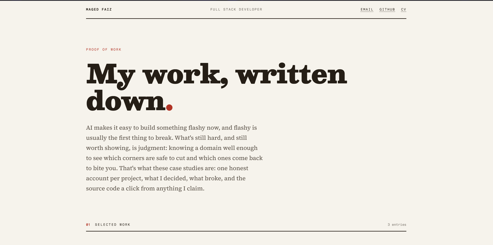

# Portfolio Monorepo

This repository contains the source code for my personal portfolio website, built with Next.js, Tailwind CSS, and Sanity. The project is structured as a monorepo using pnpm workspaces and is managed with Turborepo.



## Table of Contents

- [Portfolio Monorepo](#portfolio-monorepo)
  - [Table of Contents](#table-of-contents)
  - [Introduction](#introduction)
  - [Project Structure](#project-structure)
  - [Getting Started](#getting-started)
    - [Prerequisites](#prerequisites)
    - [Installation](#installation)
  - [Usage](#usage)
  - [Contributing](#contributing)
  - [License](#license)

## Introduction

This project is proof of work: long-form, first-person case studies grounded in real code, with snippets linked back to their repositories. Rather than a services-and-pricing template, it's built to show how I think while I ship — decisions, dead ends, and trade-offs — with interactive annotated code as the centerpiece. It's open-source, easily customizable, and deployable, with a Next.js frontend and a Sanity CMS backend for content management.

## Project Structure

This monorepo is organized using pnpm workspaces and Turborepo. The workspaces are located in the `apps` and `packages` directories:

- `apps/web`: The Next.js frontend application.
- `apps/studio`: The Sanity CMS studio for content management.
- `packages/*`: Shared packages and utilities, including `@v2/sanity-schemas` for type-safe Sanity content.

## Getting Started

### Prerequisites

- [Node.js](https://nodejs.org/en/) (v24 or later)
- [pnpm](https://pnpm.io/installation) (v11 or later)
- [Sanity CLI](https://www.sanity.io/docs/cli) (install globally)

### Installation

1. **Clone the repository:**

   ```bash
   git clone https://github.com/Maiz27/v2.git
   cd v2
   ```

2. **Install dependencies from the root directory:**

   ```bash
   pnpm install
   ```

3. **Set up environment variables:**
   - For the web app, copy `.env.example` to `.env` in `apps/web` and provide your Sanity project details.
   - For the Sanity studio, please refer to the detailed instructions in the [studio README](apps/studio/README.md).

## Usage

This project uses Turborepo to manage scripts. You can run the following commands from the root directory:

- **To start all applications in development mode:**

  ```bash
  pnpm dev
  ```

- **To build all applications for production:**

  ```bash
  pnpm build
  ```

- **To lint all applications:**

  ```bash
  pnpm lint
  ```

You can also run scripts for individual applications:

- `pnpm dev:web`: Starts the development server for the web app.
- `pnpm dev:studio`: Starts the development server for the Sanity studio.
- `pnpm build:web`: Builds the web app for production.
- `pnpm build:studio`: Builds the Sanity studio for production.
- `pnpm lint:web`: Lints the web app.
- `pnpm lint:studio`: Lints the Sanity studio.
- `pnpm generate:types`: Extracts the Sanity schema and regenerates the type-safe content types.

## Contributing

Contributions are welcome! Please fork the repository and create a pull request with your changes.

## License

This project is open-source and available under the [MIT License](LICENSE).
